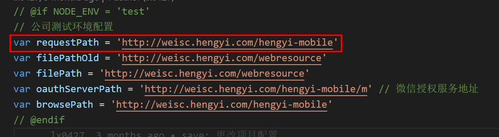

# 前端开发

## 开发

<table>
  <tr>
    <td></td>
    <td>公众号</td>
    <td>App</td>
  </tr>
  <tr>
    <td rowspan="2">测试</td>
    <td><a target="_blank" href="http://weisc.hengyi.com/hengyi-mobile/wx/pages/customer/">公众号首页</a></td>
    <td><a target="_blank" href="http://weisc.hengyi.com/hengyi-mobile/app/pages/customer/">App首页</a></td>
  </tr>
  <tr>
    <td><a target="_blank" href="http://weisc.hengyi.com/hengyi-mobile/wx/pages/salesman/workbench.html">公众号工作台</a></td>
    <td><a target="_blank" href="http://weisc.hengyi.com/hengyi-mobile/app/pages/salesman/workbench.html">App工作台</a></td>
  </tr>
  <tr>
    <td rowspan="2">正式</td>
    <td><a target="_blank" href="http://wxmall.hengyi.com/hengyi-mobile/wx/pages/customer/">公众号首页</a></td>
    <td><a target="_blank" href="http://wxmall.hengyi.com/hengyi-mobile/app/pages/customer/">App首页</a></td>
  </tr>
  <tr>
    <td><a target="_blank" href="http://wxmall.hengyi.com/hengyi-mobile/wx/pages/salesman/workbench.html">公众号工作台</a></td>
    <td><a target="_blank" href="http://wxmall.hengyi.com/hengyi-mobile/app/pages/salesman/workbench.html">App工作台</a></td>
  </tr>
</table>

### 账号密码

#### 测试

```bash
# 自主注册客户
13409909996 123456 # 注册未完善资料
15172413095 123456 # 已完善待审核
17788570427 123456 # 已审核，正式客户
# 客户
18000000003 123456
13685750532 111111
# 业务员
15000000003 123456
# 内勤
13185066035 111111
# 后台管理
hengyi/123456
```

#### 正式

```bash
# 客户
18600837536 654321 橘子
# 业务员
18668047736 wei654321 位二磊
# 后台管理
hengyi/hengyi2019
```

### 本地启动

#### 使用 chrome 访问

cookies 不同源问题 disabled

```bash
# Indicate whether a cookie is intended to be set in a cross-site context by s
chrome://flags/#same-site-by-default-cookies
chrome://flags/#cookies-without-same-site-must-be-secure
```

限制微信设备访问：

- Customize and control DevTools
- More DevTools
- Network conditions
- User agent
- Select automatically: 取消勾选
- Custom...:
  ```md
  Mozilla/5.0 (iPhone; CPU iPhone OS 7_1_2 like Mac OS X) > AppleWebKit/537.51.2 (KHTML, like Gecko) Mobile/11D257 > MicroMessenger/6.0.1 NetType/WIFI
  ```

#### 微信端

1. 拉取 develop 分支代码
2. `config.js` 中修改接口请求路径
   
3. 启动`微信端`命令
   ```bash
   npm run dev_app
   ```
4. 打开首页[`http://localhost:3000/wx/pages/customer`](http://localhost:3000/wx/pages/customer)

#### App 端

1. 拉取 develop 分支代码
2. `config.js` 中修改接口请求路径
   
3. 启动`微信端`命令
   ```bash
   npm run dev_app
   ```
4. 打开首页[`http://localhost:3000/app/pages/customer`](http://localhost:3000/app/pages/customer)

### 打包注意

#### html 中背景图片路径错误

> 公司配备电脑时才有

- 注释掉`gulpfile.js`中`minifyCSS: true,`

### 打包场景

#### 仅用于本地

```js
// @if IS_LOCAL = 1
// @endif
```

#### wx 或 app

```js
// @if APP_TYPE = 'wx'
// @endif

// @if APP_TYPE = 'app'
// @endif
```

#### 生产环境

```js
// @if NODE_ENV = 'test'
// @endif

// @if NODE_ENV = 'production'
// @endif
```

### 发布

#### 备份前端文件

```bash
cp -r /app/server/jboss-4.2.2.GA/server/default/deploy/ /app/server/jboss-4.2.2.GA/server/default/old/20200
```

#### 文件地址

- 文件目录：`F:\CODE\hy_wsc_frontend\dist`
- 测试：`/home/jboss-4.2.3.GA/server/default/deploy/hengyi-mobile.war`
- 正式：`/app/server/jboss-4.2.2.GA/server/default/deploy/hengyi-mobile.war`
- 更新：`/app/server/jboss-4.2.2.GA/server/default/upload/hengyi-mobile.war`

## 自定义组件

### infinite

#### 封装

`_footer.art`

- 根据`id:infinitePage`默认设置加载更多样式
- `getPageParam()`中默认设置请求页码+1
- 注册了上拉加载更多事件

#### 注意点

- 容器上绑定 id `infinitePage`
- 获取列表数据的函数名为 `queryData`
- 接口调用使用 `$.ajaxjsonp(url, dataMap, fnSuccess, isPage, fnComplete)`
  - `isPage` 必须设置为 true

#### 示例

html

```html
<!-- 滚动容器必须设置id:infinitePage -->
<section class="wx_main" id="infinitePage">
  <div id="list"></div>
</section>
```

js

```js
$(function() {
  initPage()
})
function initPage() {
  $('#pageIndex').val(0) // 初始化当前页数
  $('#list').html('') // 清空列表
  queryData()
}
function queryData() {
  var url = requestPath + '/m/purchase/myPurchase.htm'
  $.ajaxjsonp(
    url,
    {
      pm: $('#pm').attr('value') || 'FDY',
      pageSize: 10, // 设置每页数据条数，默认10条(可不传)
    },
    function(res) {
      $('#list').append(template('listTmp', { data: res.data.result }))
      console.log(res.data)
    },
    true // 当前页面使用加载更多，默认false(不使用)
  )
}
```

### select

#### 引用

```html
<!-- 下拉框样式引入 -->
<link rel="stylesheet" href="../../css/weui-select.min.css" />
<!-- 自定义下拉组件引入 -->
<% include ../../components/_select.art %>
```

#### 参数

- `class` 必须包含 `top_filter`
  ```html
  <ul class="top_filter"></ul>
  ```
- `id` \<string\>
- `label` \<string\> 默认展示文本
- `options` \<object\> 参考 [select 组件](http://old.jqweui.com/extends#select)
  - `onChange` \<callback\> 重置默认效果，参考`_select.art`
  - `title` \<string\> 选择框标题
  - `items` \<Array\> 下拉项数组
  - `initialValue` \<Array\> 初始值 value

#### 示例

```js
selectInit(
  'company',
  '销售组织',
  {
    title: '选择销售组织',
    items: [{ title: '恒逸石化有限公司', value: '9800' }],
    initialValue: '9800',
  },
  queryData // 选择完成执行回调
)
```

### calendar

#### 引用

```html
<% include ../../components/_calendar.art %>
```

#### 参数

- `class` 必须包含 `top_filter`
  ```html
  <ul class="top_filter"></ul>
  ```
- `id` \<string\>
- `label` \<string\> 展示文本
- `options` \<object\> 参考 [日历组件](http://old.jqweui.com/extends#calendar)
  - value: \<Array\> 初始值
- `callback` \<string\> 回调函数

#### 示例

```js
calendarInit('rqStart', '开始日期', {}, initPage)
```

### upload

:::tip 组件文件
\_upload.html <br/>
common.less => .uploadImg
:::

#### 属性

| 属性     | 描述         | 补充                                                   |
| -------- | ------------ | ------------------------------------------------------ |
| mode     | 上传展示形式 | 默认:有删除标识，nodelete:无删除标识，点击当前图片上传 |
| max      | 张数上限     | 默认值：1                                              |
| multiple | 多图上传     |                                                        |

#### 引用

```html
<div id="xyUploader" max="9" multiple="multiple"></div>

<!-- 置于<% include ../../_foot.html %>之后 -->
<% include ../include/_upload.html %>
```

```js
// wrapId：容器 id
// imgUrl：需要回显图片＜相对路径＞
uploadTemplate(wrapId, imgUrl)

// 获取上传图片路径
$('#wrapId').attr('url')
```

#### 图片预览

```html
<!-- 若使用图片预览，需添加 -->
<script src="../../lib/swiper.min.js"></script>
```

### 信息反馈

#### 单项容器

- `class`: align-center (垂直居中)

```html
<div class="visited__row align-center"></div>
```

#### 提示

- class:
  - `visited__row-tip` (默认宽度)
  - `visited__row-tip_dy` (自适应宽度)

```html
<span class="visited__row-tip">突发状况</span>
```

#### 输入框

- `class`：whole(占整行，不设置默认宽度)
- `required`: 必填项（必须设置 title）
- `title`: 同提示

```html
<input
  id="emergency"
  required
  title="突发状况"
  placeholder="请输入客户本身或市场等突发状况"
  class="visited__input whole"
  type="text"
/>
```

::: warning messageVistAddressAddNew.js
在`tempInput`中添加需要传递的字段
:::

```js
var tempInput = ['emergency']
```

#### 选择框

- `class`: checkbox (多选框, 不设置为单选框)
- `required`: 必填项（必须设置 title，默认勾选第一项）
- `title`: 同提示

```html
<div
  required
  id="downstreamMarket"
  title="下游市场"
  class="visited__row-content checkbox"
></div>
```

::: warning messageVistAddressAddNew.js

1. 插入选择框模板
2. 在`tempRadio`中添加需要传递的字段

:::

```js
tagTemplate('creditExtension', bankCredit)
var tempRadio = ['creditExtension']
```

## 功能扩展

### uniApp 页面跳转

<table>
  <tr>
    <td>属性</td>
    <td>值</td>
    <td>用法</td>
  </tr>
  <tr>
    <td rowspan="2">data-action</td>
    <td>navigateTo</td>
    <td>底部tab页</td>
  </tr>
  <tr>
    <td>switchTab</td>
    <td>非底部tab页</td>
  </tr>
</table>

```js
document.addEventListener('UniAppJSBridgeReady', function() {
  $('.uniAppJSBridgeReady').bind('toApp', function(evt) {
    uni[$(this).attr('data-action')]({
      url: $(this).val(),
    })
  })
})
```

## 预设规则

### 逸控代订单

1. 下单
2. 业务员：融资管理 - 融资管理 - 融资审核
3. 内勤审核

   ```sql
   -- 查询订单记录
   SELECT FPHM,HYNAME,CDATE,BLSFS,BLLY,HTAMT,WBNO00,WBNO01,WBNO02,WBNO03,`STATUS`,STATUS01,HTSTR08 FROM ex_contract ORDER BY CDATE DESC LIMIT 0,20;
   SELECT FPHM,HYDM,AMT,AMT1,AMT2,AMT3,CDATE,JKOPT_CODE,`STATUS`,EXTBILL,HKDATE,SALEMAN_CODE,NEIQINSH_DATE FROM fc_jkqd ORDER BY CDATE DESC LIMIT 0,20;

   -- 内勤审核（确定最新一条是需要审核数据）
   UPDATE ex_contract SET STATUS01 = 5 WHERE FPHM = (SELECT * FROM (SELECT FPHM FROM ex_contract ORDER BY CDATE DESC LIMIT 0,1) as a);
   UPDATE fc_jkqd SET `STATUS` = 5 WHERE FPHM = (SELECT * FROM (SELECT FPHM FROM fc_jkqd ORDER BY CDATE DESC LIMIT 0,1) as a);
   ```

4. 后台：融资模块 - 借款管理 - 审核
5. 客户端：我的融资 - 逸控代订单 - 发货申请（子订单）
6. 业务员：融资管理 - 还款管理 - 还款审核
7. 后台：融资模块 - 还款管理 - 审核
8. 内勤接单

   ```sql
   -- 查询订单详情记录
   SELECT sh_status,SHR_CODE,FPHM,HYDM,CDATE,WZLY,SL1,SL2,PRICE,HTAMT,PM,DQ1,DQ1CODE,DQ2,DQ2CODE,DQ3,DQ3CODE,DQNAME,CZ,GG,CD,LSXS,CK FROM ex_contract_mx ORDER BY CDATE DESC LIMIT 0,20;

   -- 内勤接单（确定最新一条是需要接单数据）
   UPDATE ex_contract_mx SET sh_status = 400 WHERE FPHM = (SELECT * FROM (SELECT FPHM FROM ex_contract_mx ORDER BY CDATE DESC LIMIT 0,1) as a);
   ```

### 纤币发放

1. `积分管理/积分规则设置`中设置次数与额度
2. `积分管理/纤币管理`中点击`商城赠送`

### 限时购

换行规则: 使用`>>`

## 调用 cookie 验证的接口

```js
/me/home/index.do 我的平台
/exp/hangsource/buy/shopping/delete.do 删除购物车信息
/exp/hangsource/buy/shopping/doDelAll.do 批量删除
/exp/hangsource/buy/shopping/doDelInvalidGoods.do 删除失效宝贝
/exp/hangsource/buy/shopping/list.do 购物车列表
/exp/hangsource/buy/shopping/save.do 将资源添加到购物车
/exp/hangsource/buy/shopping/showMargin.do 修改加价幅度弹出框
/exp/hangsource/buy/shopping/updateMargin.do 修改套餐类型加价幅度
/exp/shaddress/editConsignee.do 打开新增或者修改页面
/exp/shaddress/saveConsignee.do 保存收货人信息，并设为默认地址
/exp/admin/publicfun/historicalList.do 记忆下拉
/exp/admin/publicfun/saveHistorical.do 保存记忆
/swfupload/uploadKindEditor.do 文件上传
/exp/hangsource/buy/shopping/uptQut.do 修改购物车数量
/exp/hangsource/buy/createbill/seepage.do 成交回报
/exp/contract/view/index.do 买卖订单查看详情
/exp/payment/toBank.do 货款支付跳转到银行
/market/publicfun/logistics.do 物流商弹出框
/exp/member/authentication/toEdit.do 进入实名认证页面
/exp/member/authentication/doSave.do 提交实名认证申请
/exp/member/security/sendRandomCode.do 发送验证码
/exp/shaddress/loadShAddress.do AJAX加载收货地址
/exp/shaddress/setDefaultShAddress.do 设置一个地址为默认收货地址
/exp/shaddress/delShAddress.do 删除一个收货地址
/me/home/busaction.do 获取当前模块是否存在业务提醒
/exp/logistic/toEdit.do 会员快递设置-牵引到新增/编辑页面
/exp/logistic/save.do 会员快递设置-保存快递设置
/exp/logistic/loadExpress.do AJAX加载会员快递列表
/exp/member/security/toResMsg.do 预留信息页面
/exp/member/security/saveResMsg.do 保存信息页面
/shop/setup/loadType.do AJAX加载商铺消息类型
/exp/query/common/queryInfo.do 询货首页：询货单详情界面
/exp/classify/save.do 商品分类-保存
/exp/classify/toEdit.do 商品分类-跳转到新增/编辑
/exp/query/buy/publish/saveDirect.do 在线询货（买）：保存
/exp/query/buy/process/processPreview.do 在线询货（买）：询价详情
/exp/hangsource/buy/indtour/payMoney.do 工业旅游-支付
/exp/hangsource/buy/indtour/orderConfirm.do 工业旅游-确认订单
/me/home/msgList.do 提示消息
/fileupload/uploadKindEditor.do 文件上传
/exp/hangsource/buy/indtour/myIndtourList.do 我的工业旅游
/exp/extend/extendList.do APP-我的可推广资源列表
/exp/extend/yjList.do APP-我的佣金资源列表
/exp/extend/setParam.do APP-推广设置
/exp/extend/save.do APP-保存推广设置
/exp/extend/getWxConfig.do 微信配置文件生成
/exp/gylypayment/beforeSend2Bank.do 发送银行前，修改单据状态(工业旅游)
/exp/gylypay/doAccPAY.do 商城余额支付(工业旅游)
/exp/query/se
```
