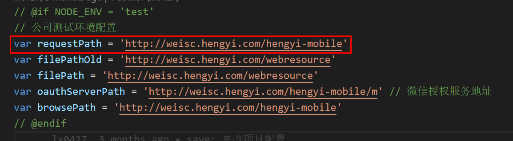

# 微商城

## 微商城页面地址

<table>
  <tr>
    <td></td>
    <td>公众号</td>
    <td>App</td>
  </tr>
  <tr>
    <td rowspan="2">测试</td>
    <td><a target="_blank" href="http://weisc.hengyi.com/hengyi-mobile/wx/pages/customer/">公众号首页</a></td>
    <td><a target="_blank" href="http://weisc.hengyi.com/hengyi-mobile/app/pages/customer/">App首页</a></td>
  </tr>
  <tr>
    <td><a target="_blank" href="http://weisc.hengyi.com/hengyi-mobile/wx/pages/salesman/workbench.html">公众号工作台</a></td>
    <td><a target="_blank" href="http://weisc.hengyi.com/hengyi-mobile/app/pages/salesman/workbench.html">App工作台</a></td>
  </tr>
  <tr>
    <td rowspan="2">正式</td>
    <td><a target="_blank" href="http://wxmall.hengyi.com/hengyi-mobile/wx/pages/customer/">公众号首页</a></td>
    <td><a target="_blank" href="http://wxmall.hengyi.com/hengyi-mobile/app/pages/customer/">App首页</a></td>
  </tr>
  <tr>
    <td><a target="_blank" href="http://wxmall.hengyi.com/hengyi-mobile/wx/pages/salesman/workbench.html">公众号工作台</a></td>
    <td><a target="_blank" href="http://wxmall.hengyi.com/hengyi-mobile/app/pages/salesman/workbench.html">App工作台</a></td>
  </tr>
</table>

## 账号密码

### 测试

```bash
# 自主注册客户
13409909996 123456 # 注册未完善资料
15172413095 123456 # 已完善待审核
17788570427 123456 # 已审核，正式客户
# 客户
18000000003 123456
13685750532 111111
# 业务员
15000000003 123456
# 内勤
13185066035 111111
# 后台管理
hengyi/123456
```

### 正式

```bash
# 客户
18600837536 654321 橘子
# 业务员
18668047736 wei654321 位二磊
# 后台管理
hengyi/hengyi2019
```

## 本地启动

### 微信端

1. 拉取 develop 分支代码
2. `config.js` 中修改接口请求路径
   
3. 启动`微信端`命令
   ```bash
   npm run dev_app
   ```
4. 打开首页[`http://localhost:3000/wx/pages/customer`](http://localhost:3000/wx/pages/customer)

### App 端

1. 拉取 develop 分支代码
2. `config.js` 中修改接口请求路径
   
3. 启动`微信端`命令
   ```bash
   npm run dev_app
   ```
4. 打开首页[`http://localhost:3000/app/pages/customer`](http://localhost:3000/app/pages/customer)

## 打包注意

### html 中背景图片路径错误

> 公司配备电脑时才有

- 注释掉`gulpfile.js`中`minifyCSS: true,`

## 打包场景

### 仅用于本地

```js
// @if IS_LOCAL = 1
// @endif
```

### wx 或 app

```js
// @if APP_TYPE = 'wx'
// @endif

// @if APP_TYPE = 'app'
// @endif
```

### 生产环境

```js
// @if NODE_ENV = 'test'
// @endif

// @if NODE_ENV = 'production'
// @endif
```

## 发布

### 备份前端文件

```bash
cp -r /app/server/jboss-4.2.2.GA/server/default/deploy/ /app/server/jboss-4.2.2.GA/server/default/old/20200
```

### 文件地址

- 文件目录：`F:\CODE\hy_wsc_frontend\dist`
- 测试：`/home/jboss-4.2.3.GA/server/default/deploy/hengyi-mobile.war`
- 正式：`/app/server/jboss-4.2.2.GA/server/default/deploy/hengyi-mobile.war`
